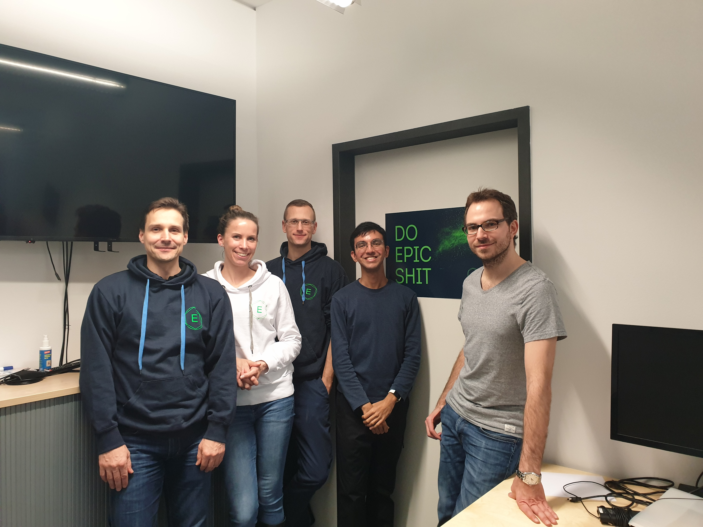
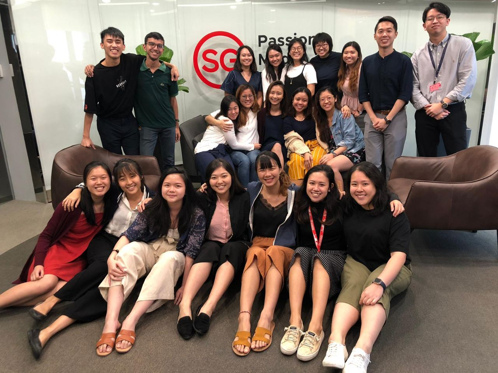
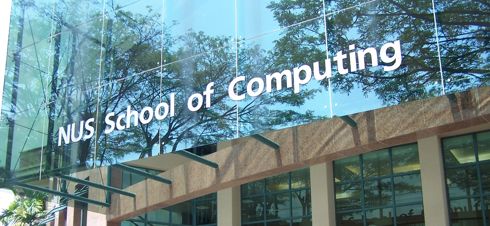
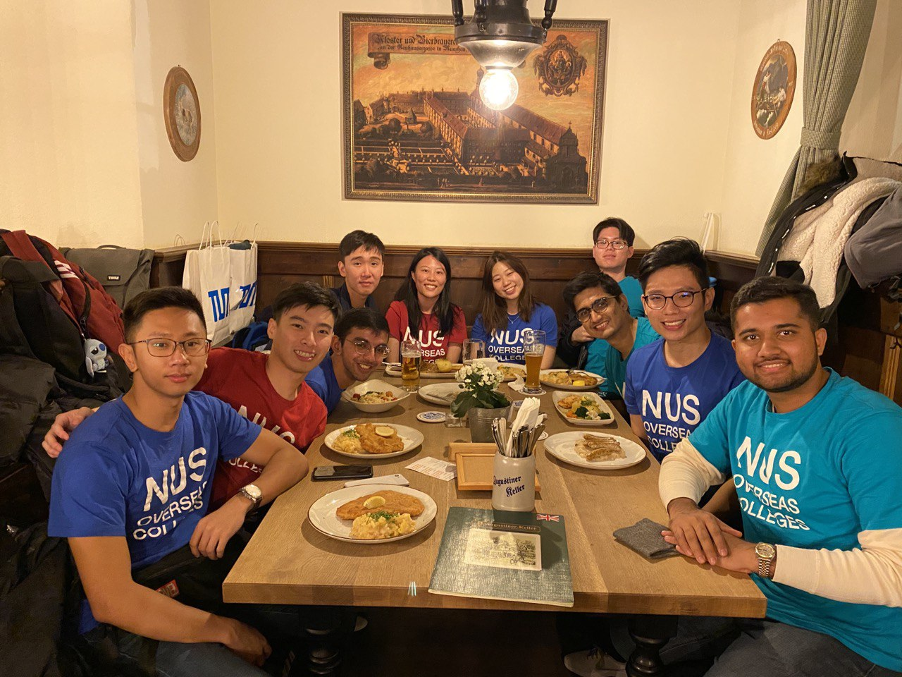
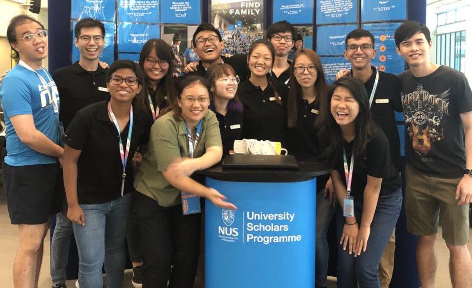
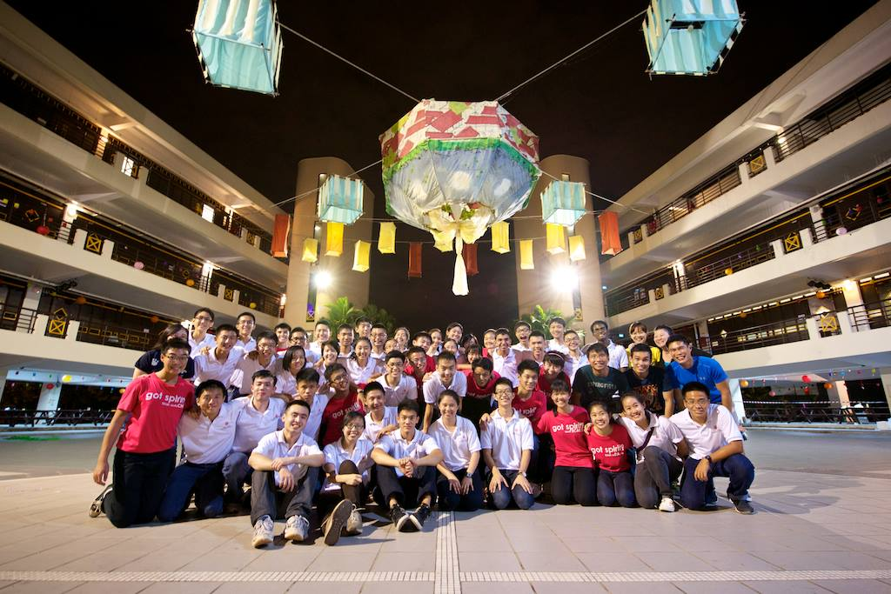

<!--- originally elements>
<!-- Main -->

<!-- One -->
<section id="one">
	

		<header class="major">
			<h1>My Experience</h1>
		</header>

<!-- Content -->
<h2 id="content">Work</h2>
		

			

				
			

			

				<h3>Software Engineering Intern, Erium</h3>
				

					Erium, based out of Garching bei Munich in Germany, develops innovative solutions that leverage advanced AI and Machine Learning technqiues, and domain expert knowledge, to enable businesses in the manufacturing industry to optimize their processes.
				<ul>
					<li>Frontend development in Angular (RxJS and NgRx) and Typescript</li>
					<li>Backend development in Python</li>
					<li>Conceptualized possible high-level system architectures</li>
				</ul>
				

			

			 
			 
		

		

			

				
			

			

				<h3>Technology Exploration Intern, Singapore Tourism Board</h3>
				

				<ul>
					<li>Full-stack app development of prototype staff app to be used by 500 employees in the organization, in design thinking sprints</li>
					<li>Developed user-facing frontend interfaces for Android in Kotlin (used libraries such as Retrofit for working with APIs).</li>
					<li>Spearheaded a backend system using Ruby on Rails for a new feature to simplify equipment loans (worked with JBuilder for building the APIs, Sidekiq for background jobs, and used both ActiveRecords + vanilla SQL to work on the underlying Postgres database).</li>
				</ul>
				

			

			 
			 
		

		

			

				
			

			

				<h3>Innovation Project Intern, Savant Degrees</h3>
				<ul>
					<li>Developed and maintained positive client relationships with clients and being the communication bridge between the client, our partners, and the Savant Teams.</li>
					<li>Assisted in facilitating design thinking/innovation workshops, driving strategic customer experience discussion.</li>
					<li>Assisted in overseeing innovation projects from start to delivery; from assessing what a client needs through pre-sales meetings, client proposals, contract preparations, to the execution and delivery of the digital solution.</li>
					<li>Assisted in planning and optimising project budget, timeline and team, and securing of resources.</li>
				</ul>
			

		

		

<h2 id="content">Education</h2>
		

				

					
				

				

					<h3>Computer Science, School of Computing, National University of Singapore</h3>
					
Minor in English Language (Linguistics).

					
Key modules taken:

					<ul>
						<li>Software Engineering Design and Principles (received recommendation letter from Vice-Dean, School of Computing, for being among the top students)</li>
						<li>Formal Methods in Software Engineering</li>
						<li>Database Systems</li>
						<li>Internet Architecture</li>
					</ul>
					
Key activities:

					<ul>
						<li>23rd NUS Students' Union (NUSSU) Public Relations Unit – Vice-Chairperson.</li>
						<li>22nd NUS Students' Union (NUSSU) Public Relations Unit – Public Relations Executive.</li>
					</ul>
				

		

		 
		

				

					
				

				

					<h3>NUS Overseas Colleges Munich, Batch 4</h3>
					

					NUS Overseas Colleges is the flagship entrepreneurship programme offered by NUS Enterprise to provide students with the opportunity to experience life at start-ups in prominent entrepreneurial hotspots the world over. The programme entails interning at an up-and-coming start-up company and attending entrepreneurship courses at a renowned partner university in that city.
					

				

		

		 
		

				

					
				

				

					<h3>University Scholars Programme, National University of Singapore</h3>
					<ul>
						<li>Chief Ambassador, USP Ambassadors Executive Committee (EXCO), Academic Year (AY) 2020/21</li>
						<li>Co-Director, Connect Tuition and Mentorship Programme (12th Run), AY2019/20 Semester 1</li>
						<li>Programmes Coordinator, Connect Tuition and Mentorship Programme (11th Run), AY2018/19 Semester 2</li>
						<li>Publicity and Communications Leader, USP Ambassadors EXCO, AY2018/19</li>
						<li>Represented Singapore and NUS at the Education for Public Inquiry and International Citizenship (EPIIC) International Symposium at Tufts University in March 2018</li>
						<li>Recepient of the Ngee Ann Kongsi UTown Scholarship for the NUS Academic Year 2017/18</li>
						<li>7th House Committee - Vice-Captain, AY2017/18</li>
						<li>End of Semester 1 Dinner Organizing Committee, AY2017/18</li>
					</ul>
				

		

		 
		

				

					
				

				

					<h3>Hwa Chong Institution</h3>
					<ul>
						<li>40th Students' Council – Internal Projects Coordinator.</li>
						<li>Organizing Committee for the 7th Hwa Chong Asia Pacific Young Leaders Summit.</li>
						<li>Represented Hwa Chong at Pre-University Summit 2013.</li>
						<li>Represented Hwa Chong Institution at the 5th International Science Youth Forum.</li>
					</ul>
				

		

	

</section>

