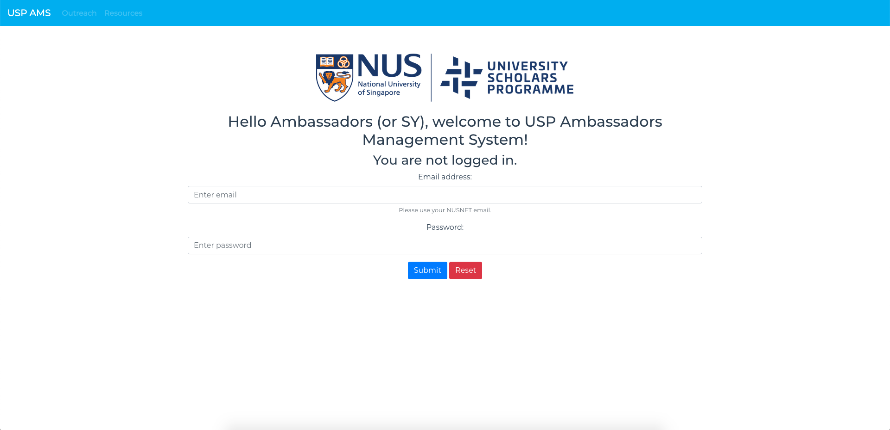

<!-- orignally generic -->
<!-- Main -->

<!-- One -->
<section id="one">
    

		<header class="major">
			<h1>Personal Projects</h1>
		</header>
        
My experimentations with software engineering, multi-disciplinary ventures and sometimes, passion projects just like Scorsese's Silence and Linklater's Boyhood. I'm always on the lookout for exciting projects: if what I have to offer can help you, hit me up for a chat.

<!-- Content -->
		

            

		        
	        
    
			

		        <h3>NUS USP Ambassadors Management System (AMS)</h3>
		        
Being an executive committee member in charge of publicity and communications, I noted the difficulties of manually tracking the involvement and training requirements of the ambassadors in the team. Speaking to the admin staff in charge of the programme, she retiterated these concerns and suggested some features that a hypothetical management system could have. With that in mind, I went about building an MVP version of such a system using Vue + Node.js. In this proof of concept, an administrator can manage USP outreach events and ambassador details while ambassadors can sign up for events and keep track of their involvement. The <a href="http://nususp-ams-demo.pratyayj.com">demo version</a> of this site is currently hosted on OCI with AWS Lambda + API Gateway serving static files from S3. Please contact me if you would like to take the system for a spin.

	        
	     
        

		

            

		        
	        
    
			

		        <h3>Restaurant Booking App</h3>
		        
As a part of the database systems introductory module I took at college, my project team and I were tasked with building a restaurant booking application. We used HTML5 and CSS for the front-end (taking advantage of Bootstrap styling) and used NodeJS and PostgreSQL for the back-end. I was involved with the development of the administrator-facing system (editing of customers, bookings, restaurants, cuisine, branch and viewing of statistics). Furthermore, I did the UI for the administrator-facing system. I also created the rating system for customers to rate restaurant branches. Through this project I also honed my skills in modelling entity-relation (ER) diagrams and I was involved in the creation of the final ER diagram for submission.

	        
	     
        

		

            

				

		        	
	        	
    
			

			

		        <h3>Hakka Language Documentation Project</h3>
		        
Being a minor student in linguistics as part of my interest for Natural Language Processing, I took a module in Language Documentation where for our final submission we were tasked with using programs such as ELAN and FLEx to create a transcription and dictionary (respectively) of a heritage language in Singapore. To better present our end product, I exported the files in HTML and XHTML formats and did some tweaking to allow for search functionality, allow for audio to be played in the browser itself and linked the transcription and dictionary files together. Click the image to check out the project for yourself.

	        
	     
        

        

            

		        
	        

	        

		        <h3>jalan jalan</h3>
		        
jalan jalan (local slang for 'take a walk') is an app on the Android platform incorporating Google Maps APIs and Firebase. We believe that Singapore, much like Boston and Melbourne, are eminently walkable cities. A myriad of attractions of all kinds are within minutes of one another. And not to mention, the journey getting there might hold a surprise discovery or two! jalan jalan aggregates the many static walking trails available onsite and online on the app, allowing tourists and Singaporeans alike to navigate their way easily to key sights and sounds while delighting in the a multitude of food options and exploring Singapore in the best way possible, on foot. My teammate and I received the advanced level of achievement for the Summer Software Development Project and we have plans to take the project further in the future.

	        

        

    

</section>

