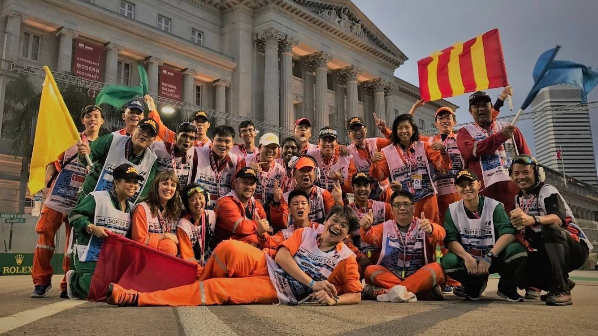

<!-- Main -->

<!-- One -->
<section id="one">
    

		<header class="major">
			<h1>Out Of The Box</h1>
		</header>

        
Academic and work pursuits are only but a part of who I am. Whenever the opportunity comes for me to try something new and out of my comfort zone, I never fail to seize it. The following is an assortment of my pursuits that have brought me much joy and growth.

<!-- Content -->
        

            

                <h3>Transit</h3>
                
In March 2018, a group of friends and I participated in a 52-hour short film competition, Point & Shoot, organized by NUStudios. The theme for the competition, revealed to us only at the start of the time period, was 'Mirror'. With a keen passion for film and film-making and having learnt Premiere Pro and After Effects on my own in Junior College for Student Council events, to have the chance to produce a short film of my own was an opportunity that I could not pass up. The film centers around two people who relive their memories of a once intimate connection.

            

            

                <iframe width="700" height="393" src="https://www.youtube.com/embed/M3lsDXYmo-M" frameborder="0" allow="accelerometer; autoplay; encrypted-media; gyroscope; picture-in-picture" allowfullscreen></iframe>
            

            

		        
	        

	        

		        <h3>Race Official, F1 Singapore Grand Prix</h3>
		        
Since 2016, I've been a part of the team of dedicated and committed race officials team for the F1 Singapore Grand Prix. For each of the three years, I've been involved in three different roles: trackside marshal, flag marshal and newsletter official. Each of these three roles have provided me a unique volunteering experience in this event that is now a hallmark of Singapore's calendar.

	        

        

    

</section>

