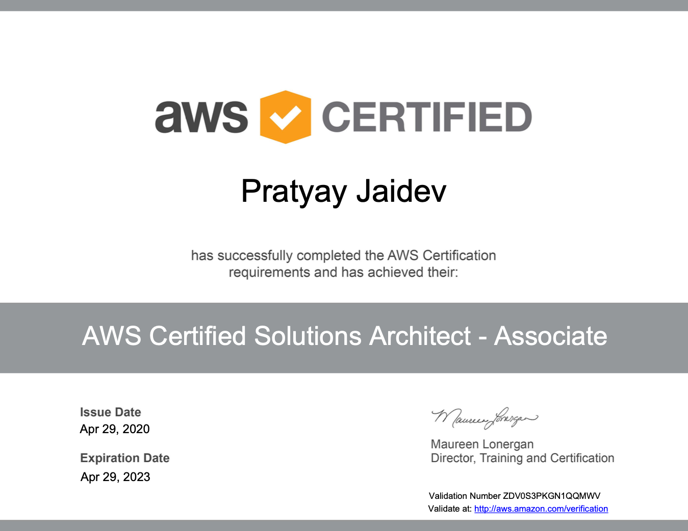

<!-- orignally generic -->
<!-- Main -->

<!-- One -->
<section id="one">
    

		<header class="major">
			<h1>Out Of The Box</h1>
		</header>
        
There's more to personal growth than simply academics and work. Every pursuit is an opportunity to learn in a myriad of ways.

<!-- Content -->
        

            

		        

                
                

	        

	        

		        <h3>AWS Certified Solutions Architect - Associate</h3>
		        
In my quest to be a multi-cloud expert, I first began by consolidating my fundamental understanding of the cloud by taking the <a href="https://www.youracclaim.com/badges/566ba1e5-2e3d-4a88-a342-b9597e8e7cef/public_url">AWS Cloud Practitioner</a> and <a href="https://www.youracclaim.com/badges/afd418e1-74af-4118-8fb2-ec610b0e8d57/public_url">Microsoft Azure Fundamentals</a> courses. Having greater confidence upon clearing those, I decided to take the plunge and get my first solutions architect certification in AWS ecosystem. Achieving the certification by was no means easy, but with buoyed by a passion for the cloud, every lesson and every hands-on was an enriching experience.

	        

        

        

        

            

                <h3>Oracle Cloud Infrastructure 2018 Certified Architect Associate</h3>
		        
I was always intrigued by the possibilities offered by the cloud and so in the summer of 2019 I decided to dither no further, and took my first steps into the field by getting certified as an architect associate in Oracle Cloud Infrastructure. It's only a start but I'm truly excited by the tremendous opportunities, particularly in confluence with art and culture - if you're someone with a similar inclination and have ideas you wish to dive into, drop me an email.

            

            

                

                
                

            

        

        

        

            

		        
	        

	        

		        <h3>Education for Public Inquiry and International Citizenship (EPIIC) International Symposium</h3>
		        
Being a Computer Science major does not mean that my interests are confined to just that! Global affairs and international relations are two areas that I keep a close eye on and engage in frequent discussions about. In March 2018, I was given the opportunity to be a part of the Singapore and NUS delegation to the EPIIC International Symposium held at Tufts University where I had the chance to enagge in panel discussions with leaders in a variety of fields, students from the world over and even military personnel on the issue, 'Is the Liberal World Order Ending?'. The picture is of the Singapore delegation with the Deputy Secretary General of the United Nationals, Amina J. Mohammed.

	        

        

        

        

            

                <h3>Transit</h3>
                
In March 2018, a group of friends and I participated in a 52-hour short film competition, Point & Shoot, organized by NUStudios. The theme for the competition, revealed to us only at the start of the time period, was 'Mirror'. With a keen passion for film and film-making and having learnt Premiere Pro and After Effects on my own in Junior College for Student Council events, to have the chance to produce a short film of my own was an opportunity that I could not pass up. The film centers around two people who relive their memories of a once intimate connection. Our short film was given an Honourable Mention at the Frameworks Film Festival 2018. Click the image to view the film on YouTube.

            

            

                

                
                

            

        

            

        

            

		        
	        

	        

		        <h3>Race Official, F1 Singapore Grand Prix</h3>
		        
From 2016 to 2018, I was a part of the dedicated and committed race officials team for the F1 Singapore Grand Prix. For each of the three years, I've been involved in three different roles: trackside marshal, flag marshal and newsletter official. Each of these three roles have provided me a unique volunteering experience in this hallmark event on Singapore's calendar.

	        

        

            

        

            

                <h3>Connect Tuition and Mentorship Programme</h3>
		        
Connect Tuition and Mentorship is a programme at the NUS University Scholars Programme, where undergraduate students teach and mentor students from communities neighbouring the university. After being a mentor for 3 runs, I transitioned to serving in the capacity of Programmes Coordinator where one of the marquee events we organized was a Human Library format sharing session by members of the USP community about their interests and pursuits outside of the classroom, to expose mentees to opportunities & inspire them to pursue their passions. Following that run, I went on to serve as Co-Director, heading up all operational aspects and overseeing other intiatives and activities that run parallel to our weekly tutoring and mentoring.

            

            

                
            

        

        

        

            

		        
	        

	        

		        <h3>Goody 2 Shoes</h3>
		        
As an Internal Project Coordinator in the 40th Hwa Chong Students' Council, my working partner and I organized Goody 2 Shoes, a school-wide shoes donation drive for victims of Typhoon Sendong in the Philippines as part of our vision to underscore that collectively the impact we can make is immense. The project amassed a grand total of thousand shoes which were subsequently shipped over in August.

	        

        

    

</section>

