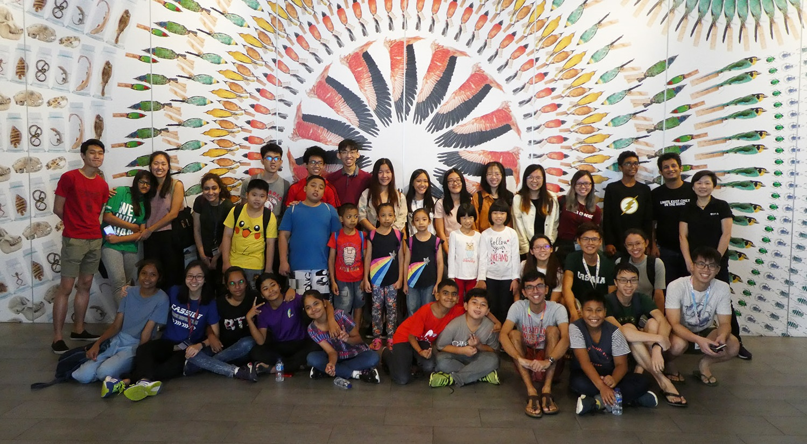

<!-- orignally generic -->
<!-- Main -->

<!-- One -->
<section id="one">
    

		<header class="major">
			<h1>Out Of The Box</h1>
		</header>

        
Academic and work pursuits are but a part of who I am. Whenever the opportunity comes for me to try something new and out of my comfort zone, I never fail to seize it. The following is an assortment of my pursuits that have brought me much joy and growth.

<!-- Content -->
        

            

                <h3>Oracle Cloud Infrastructure 2018 Certified Architect Associate</h3>
		        
I've always been intrigued by the possibilities offered by the cloud and during the summer of 2019 I decided to take my first steps towards exploring where I might get myself involved by taking up certification in Oracle Cloud Infrastructure. It's only a start but I'm truly excited by the tremendous opportunities, particularly in confluence with art and culture - and so if you have any opportunities you wish to dive into with someone who shares a similar passion, look no further!

            

            

                

                
                

            

        

        

        

            

		        
	        

	        

		        <h3>Education for Public Inquiry and International Citizenship (EPIIC) International Symposium</h3>
		        
Being a Computer Science major does not mean that my interests are confined to just that! Global affairs and international relations are two areas that I keep a close eye on and engage in frequent discussions about. In March 2018, I was given the opportunity to be a part of the Singapore and NUS delegation to the EPIIC International Symposium held at Tufts University where I had the chance to enagge in panel discussions with leaders in a variety of fields, students from the world over and even military personnel on the issue, 'Is the Liberal World Order Ending?'. The picture shows the Singapore delegation with the Deputy Secretary General of the United Nationals, Amina J. Mohammed.

	        

        

        

        

            

                <h3>Transit</h3>
                
In March 2018, a group of friends and I participated in a 52-hour short film competition, Point & Shoot, organized by NUStudios. The theme for the competition, revealed to us only at the start of the time period, was 'Mirror'. With a keen passion for film and film-making and having learnt Premiere Pro and After Effects on my own in Junior College for Student Council events, to have the chance to produce a short film of my own was an opportunity that I could not pass up. The film centers around two people who relive their memories of a once intimate connection. Our short film was given an Honourable Mention at the Frameworks Film Festival 2018. Click the image to view the film on YouTube.

            

            

                

                
                

            

        

            

        

            

		        
	        

	        

		        <h3>Race Official, F1 Singapore Grand Prix</h3>
		        
Since 2016, I've been a part of the team of dedicated and committed race officials team for the F1 Singapore Grand Prix. For each of the three years, I've been involved in three different roles: trackside marshal, flag marshal and newsletter official. Each of these three roles have provided me a unique volunteering experience in this event that is now a hallmark of Singapore's calendar.

	        

        

            

        

            

                <h3>Connect Tuition and Mentorship Programme</h3>
		        
Connect Tuition and Mentorship is a programme at the NUS University Scholars Programme, where undergraduate students teach and mentor students from communities neighbouring the university. After being a mentor for 3 runs, I transitioned to serving in the capacity of Programmes Coordinator where one of the hallmark events we organized was  an evening where our mentees had the chance to hear and learn from members of the USP community about their interests and pursuits outside of the classroom in a Human Library format. I currently serve as Co-Director, heading up all operational aspects and overseeing other intiatives and activities that run parallel to our weekly tutoring and mentoring.

            

            

                
            

        

        

        

            

		        
	        

	        

		        <h3>Goody 2 Shoes</h3>
		        
As an Internal Project Coordinator in the 40th Hwa Chong Students' Council, my working partner and I organized Goody 2 Shoes, a school-wide shoes donation drive for victims of Typhoon Sendong in the Philippines. We amassed a grand total of a 1000 shoes in the process. Indeed, the process went to show that though individually we may not be able to do much, small acts of love add up to something big.

	        

        

    

</section>

